 

# Hi, I'm Elvadsah 👋

### Software Developer · Web Development · Cloud · AI/ML

Building reliable software, exploring modern technologies, and turning ideas into practical solutions.

 

---

## 👨‍💻 About Me

I'm a developer who enjoys designing, building, and improving software systems.

My interests span across **web development, backend engineering, cloud infrastructure, AI/ML, and system design**. I enjoy working on projects where technology can be transformed into something useful, maintainable, and scalable.

I'm continuously learning, experimenting with new technologies, and contributing to projects that challenge me to improve my engineering skills.

### What I'm Currently Exploring

* ☁️ **Cloud & Infrastructure** — deployment, networking, automation, and scalable systems
* 🤖 **AI / Machine Learning** — AI-powered applications and developer tooling
* 🏗️ **System Design** — architecture, scalability, reliability, and maintainability
* 🌐 **Web Development** — modern frontend and backend applications
* 🔓 **Open Source** — collaboration, experimentation, and knowledge sharing

---

## 🛠️ Technologies & Tools

### Languages

### Frameworks & Libraries

### Infrastructure & Tools

### Databases

> My technology stack evolves continuously as I explore new tools and approaches.

---

## 📊 GitHub Activity

  

---

## 🐍 Contribution Activity

<picture>
  <source
    media="(prefers-color-scheme: dark)"
    srcset="https://raw.githubusercontent.com/elvadsah/elvadsah/output/github-snake-dark.svg"
  />
  <source
    media="(prefers-color-scheme: light)"
    srcset="https://raw.githubusercontent.com/elvadsah/elvadsah/output/github-snake.svg"
  />
  
</picture>

---

## 🤝 Let's Connect

 

<i>ὅτι ἃ μὴ οἶδα οὐδὲ οἴομαι εἰδέναι.</i>
“What I do not know I do not think I know.”
— <b>Socrates</b>, Plato, <i>Apology</i> 21d
 

⭐ Thanks for visiting my profile!

