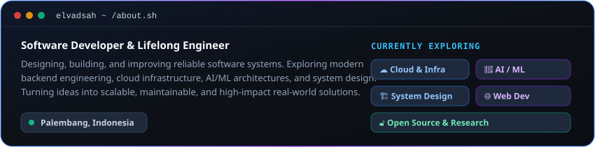
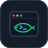

  

  
  

---

## 👨‍💻 About Me

  

---

## 🛠️ Technologies & Tools

<table align="center">
  <tr>
    <td align="center" width="96"> <b>FastAPI</b></td>
    <td align="center" width="96"> <b>Python</b></td>
    <td align="center" width="96"> <b>Javascript</b></td>
    <td align="center" width="96"> <b>TypeScript</b></td>
    <td align="center" width="96"> <b>React</b></td>
    <td align="center" width="96"> <b>Github</b></td>
    <td align="center" width="96"> <b>Rest API</b></td>
    <td align="center" width="96"> <b>Docker</b></td>
    <td align="center" width="96"> <b>Nginx</b></td>
  </tr>
  <tr>
    <td align="center" width="96"> <b>Git</b></td>
    <td align="center" width="96"> <b>Actions</b></td>
    <td align="center" width="96"> <b>HTML</b></td>
    <td align="center" width="96"> <b>CSS</b></td>
    <td align="center" width="96"> <b>Tailwind</b></td>
    <td align="center" width="96"> <b>Vite</b></td>
    <td align="center" width="96"> <b>React Query</b></td>
    <td align="center" width="96"> <b>PostgreSQL</b></td>
    <td align="center" width="96"> <b>MySQL</b></td>
  </tr>
  <tr>
    <td align="center" width="96"> <b>Redis</b></td>
    <td align="center" width="96"> <b>Postman</b></td>
    <td align="center" width="96"> <b>Linux</b></td>
    <td align="center" width="96"> <b>WSL</b></td>
    <td align="center" width="96"> <b>Fish Shell</b></td>
    <td align="center" width="96"> <b>Express</b></td>
    <td align="center" width="96"> <b>Laravel</b></td>
    <td align="center" width="96"> <b>RabbitMQ</b></td>
    <td align="center" width="96"> <b>Pytest</b></td>
  </tr>
</table>

---

## 📊 GitHub Activity

  

  

---

## 🤝 Let's Connect

  
  
  
  

 

  

